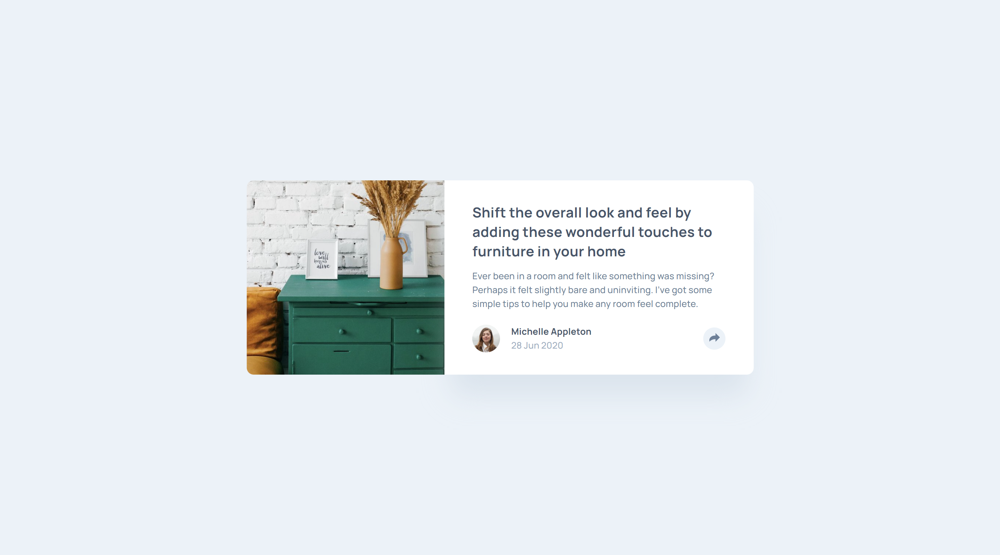
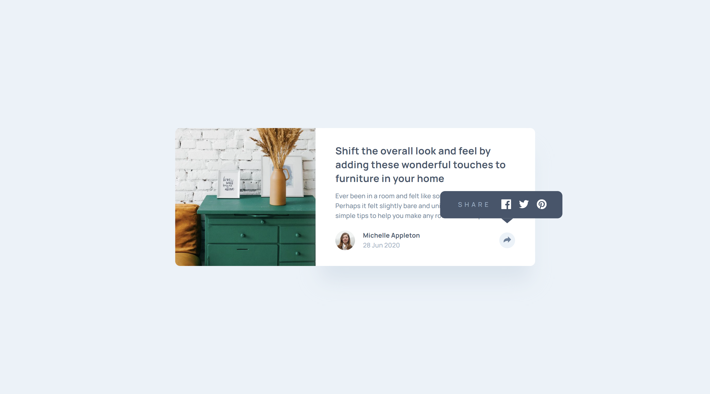

# Article preview component

## Índice

- [Resumo](#resumo)
  - [Screenshot](#screenshot)
  - [Links](#links)
- [Processo](#processo)
  - [Construção](#construção)
  - [Aprendizado](#aprendizado)
  - [Recursos](#recursos)
- [Autor](#autor)

<br/>

# Resumo

Projeto ficticio representando um componente de visualização previo de artigo, contem uma imagem, título, conteúdo, autor, data e botão para compartilhamento. Este, quando clicado, exibi um pop-up com as opções de redes sóciais disponiveis para comparilhamento. Retirado de um desafio do site [FrontEnd Mentor](https://www.frontendmentor.io/challenges/article-preview-component-dYBN_pYFT).

Os usuários devem ser capazes de:

- Ver o layout ideal para o componente dependendo do tamanho da tela de seu dispositivo;
- Veja os links de compartilhamento de mídia social quando eles clicam no ícone de compartilhamento.

<br/>

## Screenshot

<p style="text-align:center;">
    
</p>

<br/>

<p style="text-align:center;">
    
</p>

<br/>

## Links

- [Pré-visualização de comentário]()

<br/>

# Processo

<br/>

## Construção
- Mobile-first
- React
- CSS Module


<br/>

# Aprendizado

***Desenvolver lógica que possibilita a abertura do dropdown "pop-up" que disponibiliza as redes sociais para compartilhar.***

```javascript
import React, { useState } from "react";
import styles from "./Profile.module.css";

export default function Profile({ name, date }) {
  const [dropdownOpen, setdropdownOpen] = useState(false);
  const toggleDropdown = () => {
    setdropdownOpen(!dropdownOpen);
  };

  return (
    <section className={styles.container}>
      <div
        className={styles.personIcon}
        style={{ backgroundImage: `url('/images/avatar-michelle.jpg')` }}
      ></div>

      <div className={styles.personId}>
        <h2>{name}</h2>
        <h3>{date}</h3>
      </div>

      <div role="dialog" arial-aria-modal="true" className={styles.modal}>
        <button onClick={toggleDropdown}>
          
        </button>

        {dropdownOpen && (
          <nav>
            <span>Share</span>

            <a href="#">
              
            </a>
            <a href="#">
              
            </a>
            <a href="#">
              
            </a>

            <button onClick={toggleDropdown}>
              <svg xmlns="http://www.w3.org/2000/svg" width="15" height="13">
                <path
                  fill="#FFFFFF"
                  d="M15 6.495L8.766.014V3.88H7.441C3.33 3.88 0 7.039 0 10.936v2.049l.589-.612C2.59 10.294 5.422 9.11 8.39 9.11h.375v3.867L15 6.495z"
                />
              </svg>
            </button>
          </nav>
        )}
      </div>
    </section>
  );
}

```

<br/>

# Recursos

- [Documentação do React](https://pt-br.reactjs.org/docs/getting-started.html)
- [Documentação de Hooks](https://pt-br.reactjs.org/docs/hooks-intro.html)
- [Documentação sobre Componentes](https://pt-br.reactjs.org/docs/components-and-props.html)
- [Documentação sobre o uso de Estado (State)](https://pt-br.reactjs.org/docs/state-and-lifecycle.html)
- [Documentação sobre Estilização de Componentes](https://pt-br.reactjs.org/docs/faq-styling.html)
- [Documentação sobre Eventos](https://pt-br.reactjs.org/docs/handling-events.html)
- [Documentação sobre Composição de Componentes](https://pt-br.reactjs.org/docs/composition-vs-inheritance.html)
- [Documentação sobre Renderização Condicional](https://pt-br.reactjs.org/docs/conditional-rendering.html)

<br/>

# Autor

<div align="center">

<a href="https://www.linkedin.com/in/mathewsmattar/" target="_blank">
  
</a>
<a href="mailto:mathmattar@hotmail.com" target="_blank">
  
</a>

</div>
